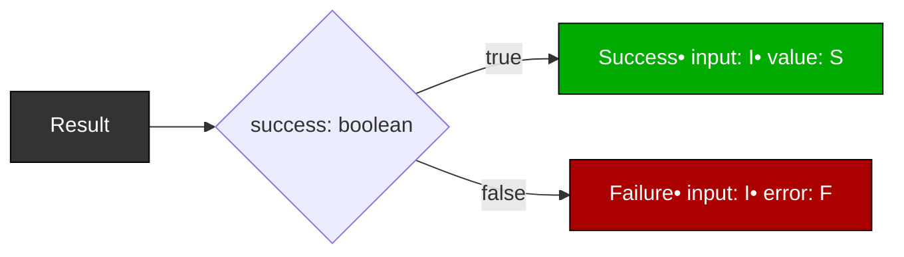

# PrincipiaFerarum.md

Being a Treatise on Intent, Documentation, and the Taming of Future‑Me

## Preamble

This repository is not merely a collection of files; it is a living ecosystem of ideas, experiments, and occasionally questionable decisions.

To prevent chaos (or at least to contain it), this document establishes the guiding principles, constraints, and rituals by which the codebase shall be governed.

These principles are not laws. They are intentions — a compass for Present‑Me and a mercy for Future‑Me.

## I. The Spirit of the Project

1. **This is a hobby project**.  
  There are no deadlines, stakeholders, or quarterly OKRs.
  The only KPI is “Did I enjoy building this?”

2. **Clarity beats cleverness**.  
  If Future‑Me cannot understand a piece of code without caffeine and archaeology, Present‑Me has failed.

3. **Documentation lives with the code**.  
  Not in a wiki. Not in a PDF. Not in a forgotten folder.
  *In the code.*

4. **AI is a collaborator, not a supervisor**.  
The AI agent is here to help, not to lecture, therapize, or infantilize.

## II. Documentation Philosophy

This project uses a dual‑channel documentation system:

### 1. Formal Documentation (Machine‑Readable)

Embedded directly in the code via JSDoc and a small set of custom tags.  
These are extracted into `/docs` during compilation.

### 2. Informal Documentation (Human‑Readable)

Longer narrative notes addressed to Future‑Me or other personas.  
These are not included in formal docs and may be scanned separately.

*(The “Dear %persona%” system is not yet active, but its shadow looms.)*

## III. Custom JSDoc Tags

A compact reference for the structured annotation system.

`@intent`  
**Purpose**: Explain why this code exists — the design intent, constraints, or philosophy.  
**Use when**: The reasoning matters as much as the implementation.

Example:

```ts
/**
 * @intent Normalize config loading across runtimes without leaking FS details.
 */
```

`@ai`  
**Purpose**: Provide short, explicit instructions to AI agents.  
**Use when**: You want machine‑readable guidance without cluttering human docs.

Example:

```ts
/**
 * @ai Avoid refactoring; relies on subtle Deno permissions behavior.
 */
```

`@future`  
**Purpose**: A structured micro‑note to Future‑Me.  
**Use when**: You want a reminder that should appear in scans but not in formal docs.

Example:

```ts
/**
 * @future Replace this with a proper type once shapes stabilize.
 */
```

`@todo`  
**Purpose**: A non‑binding breadcrumb for potential future work.  
**Use when**: You want to mark an idea without committing to it.

Example:

```ts
/**
 * @todo Consider streaming parser if file sizes grow.
 */
```

`@decision`  
**Purpose**: Record a small architectural decision (micro‑ADR).  
**Use when**: You want to capture reasoning inline without writing a full ADR.

Example:

```ts
/**
 * @decision Using discriminated unions for error handling to avoid exceptions.
 */
```

`@example`  
Standard JSDoc tag.  
**Purpose**: Provide usage examples for documentation extraction.

## IV. Error Handling Doctrine

All components return **discriminated unions** representing success or failure.  
This ensures clarity, explicitness, and zero surprise exceptions.



```ts
type Result<I, S, F> =
  | { success: true;  input: I; value: S }
  | { success: false; input: I; error: F };
```

```TS
function parseAge(input: string): Result<string, number, string> {
  const num = parseInt(input, 10);
  if (isNaN(num)) {
    return { success: false, input, error: "Invalid number" };
  }
  return { success: true, input, value: num };
}

// Usage:
const result = parseAge("25");

if (result.success) {
  console.log(`Parsed ${result.input} → ${result.value}`); // "Parsed 25 → 25"
} else {
  console.error(`Failed on "${result.input}": ${result.error}`); // e.g. "Failed on 'xyz': Invalid number"
}
```

This pattern is preferred because:

- It is explicit

- It is testable

- It is friendly to both humans and machines

- It avoids exception‑driven control flow

- It pairs beautifully with `@intent` and `@decision` tags

## V. Assumptions & Constraints

### Assumptions

- Excel files always include a header row.

- Filenames are UTF‑8 and OS‑safe.

- User has read/write permissions.

- Deno 2.x+ is installed.

- Tooling is Deno‑centric (`deno.json`, `.vscode/settings.json`).

- No filesystem writes occur without explicit user permission.

### Constraints

- Must run on Deno (no Node native modules).

- Max Excel sheet size: 50MB.

- No external dependencies beyond Deno stdlib + JSR packages.

- All file operations must be logged before execution for undo support.

## VI. AI Agent Guidelines & Persona

**The AI collaborator shall:**

- Be playful, direct, and witty.

- Avoid corporate tone, excessive politeness, or therapy‑speak.

- Assume technical competence without assuming omniscience.

- Provide code + concise explanation when asked.

- Use step‑by‑step reasoning for architecture or debugging.

- Be honest about deprecated or experimental features.

- Use dry humor when pointing out mistakes.

- Remember: this is a hobby project, not a production system.

## VII. Closing Remarks

The purpose of **PrincipiaFerarum** is not to impose rigidity but to preserve intent.  
It is a map, not a cage.  
Future‑Me may revise it, expand it, or ignore it entirely — but at least Present‑Me has left breadcrumbs.

*Thus concludes the first edition of the Principles of the Beasts.*

**Remember**:  
> All code is temporary.
